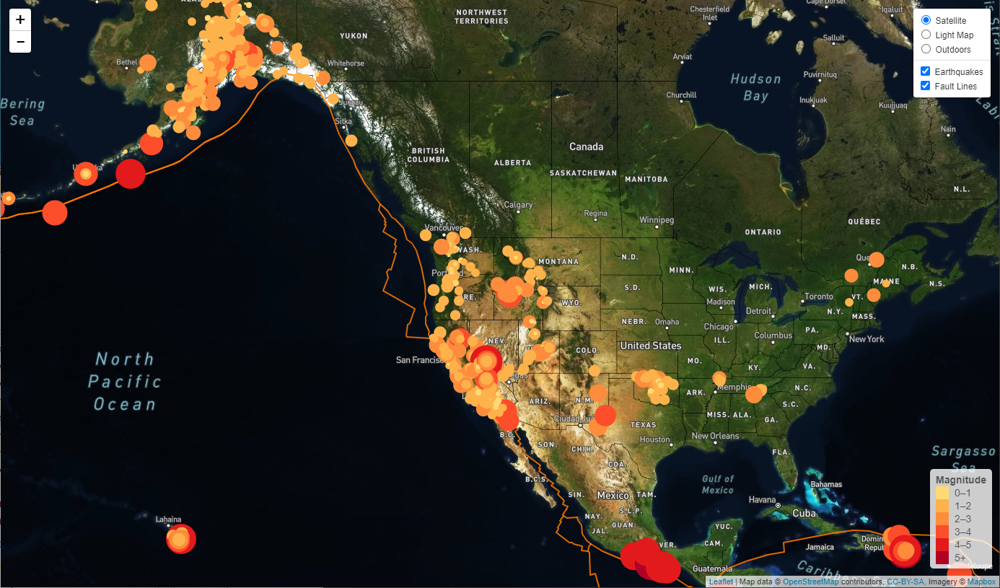

# Visualizing Seismic Data with Leaflet

**Note:** To run this, you must use your own mapbox token key. You can add your key in the provided file *static/js/config_dummy.js* and then rename it to *config.js*.


### Step #1 - All Earthquakes in the Past 7 Days

**Data source**:  [USGS GeoJSON](http://earthquake.usgs.gov/earthquakes/feed/v1.0/geojson.php)

For this step change the JavaScript in the *index.html* to *Leaflet-Step-1/js/logic.js*:

```
<script type="text/javascript" src="Leaflet-Step-1/js/logic.js"></script>
```


A map that plots all earthquakes in the past 7 days based on their longitude and latitude was created:

- Data markers reflect the magnitude of the earthquake in their size and color. Earthquakes with higher magnitudes appears larger and darker in color.
- The map includes popups that provide additional information about the earthquake when a marker is clicked.
- A legend that provides context for the map data was created.


### Step #2 - Adding Fault Lines

**Data source:** https://github.com/fraxen/tectonicplates

For this step change the JavaScript in the *index.html* to *Leaflet-Step-2/js/logic.js*:

```
<script type="text/javascript" src="Leaflet-Step-2/js/logic.js"></script>
```

- The second data set, with data on tectonic plates, was added to the map to illustrate the relationship between tectonic plates and seismic activity. 
- Three base map layers were created to choose from: light, satellite, outdoors 
- Two data sets, earthquakes and tectonic planes,  were separated into overlays that could be turned on and off independently.
- Layer controls were added to the map.
- The legend for the earthquakes layer was configured to be turned on and off together with the layer
- When the earthquakes layer is on, it is kept always on top ([helpful resource](https://gis.stackexchange.com/questions/183914/how-to-keep-vector-layer-on-top-of-all-layers-despite-toggling-order))





### Tools / Techniques Used:

- JavaScript
- Leaflet.js
- D3.js
- HTML/CSS
- GeoJSON
- [Mapbox API](https://www.mapbox.com/)


